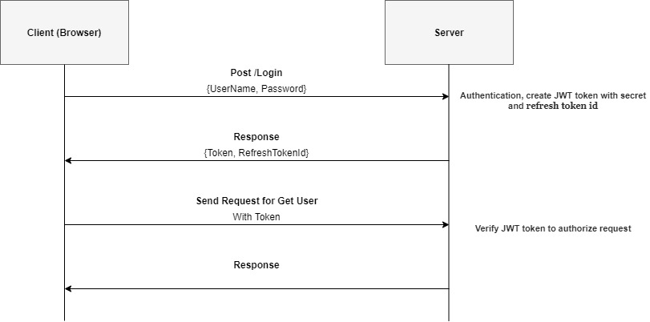
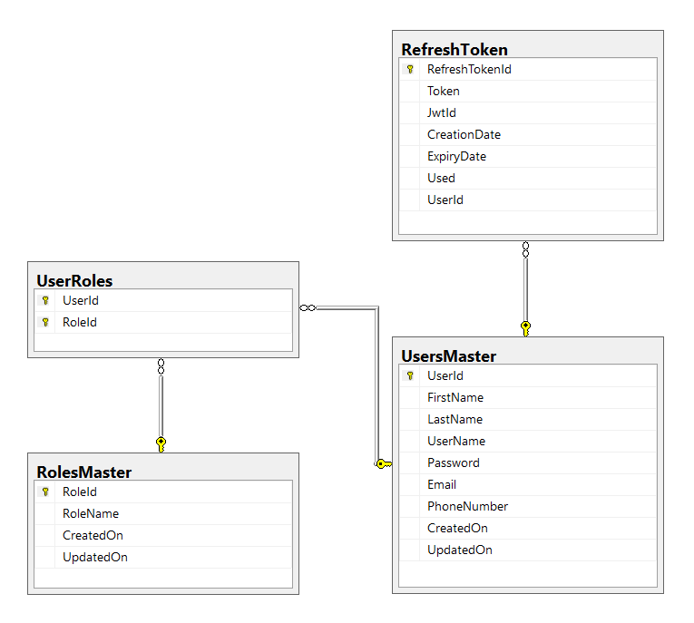
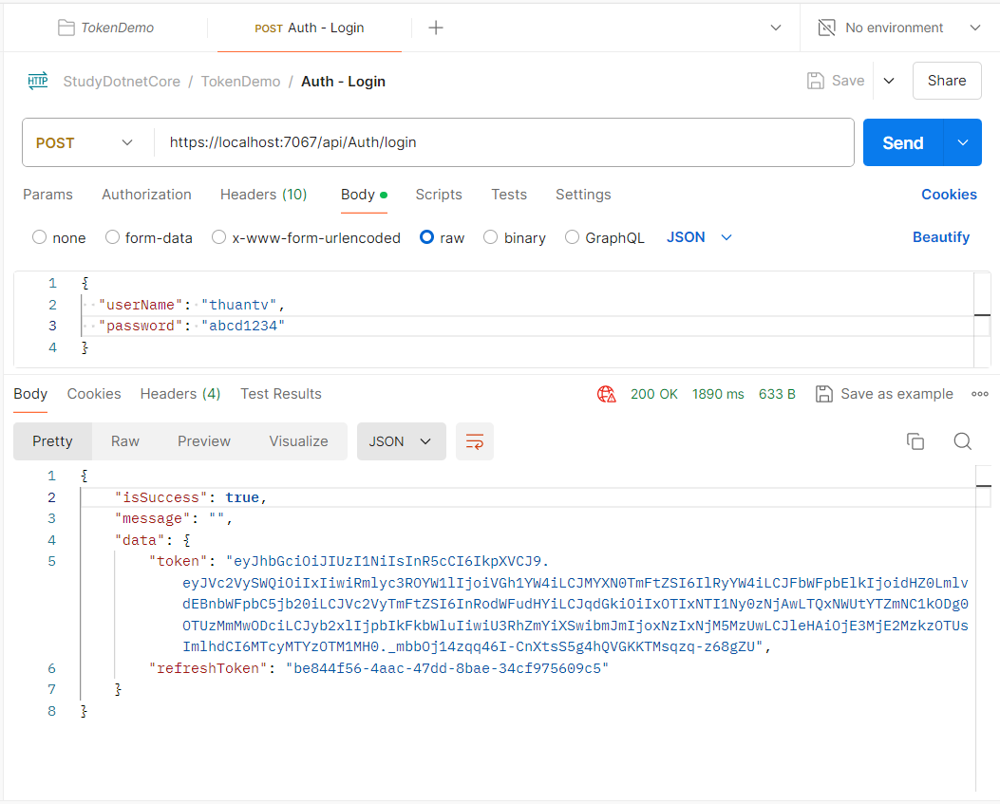
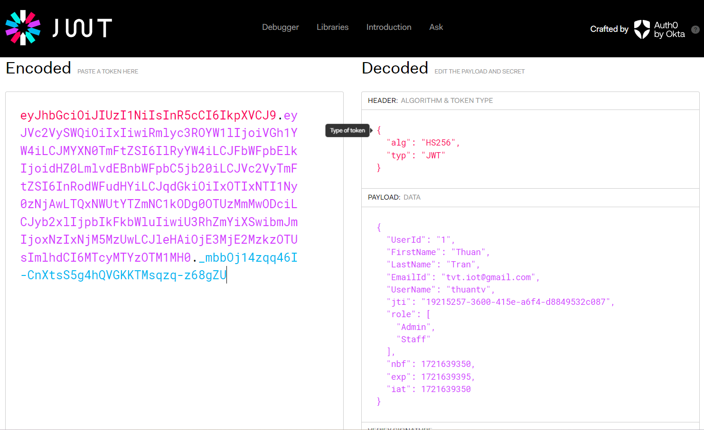
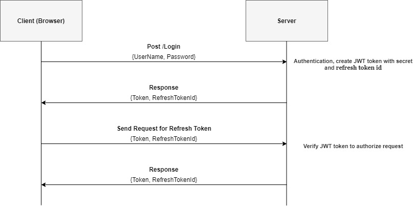
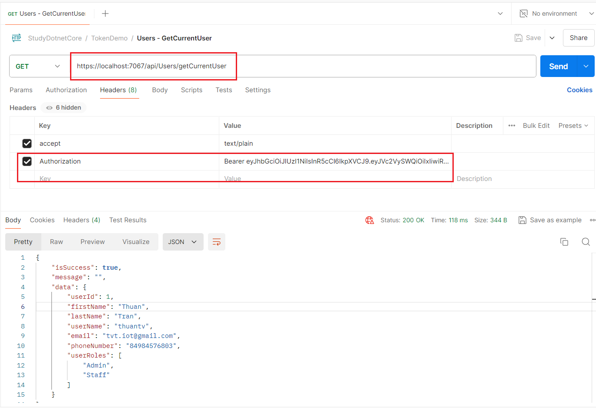

# Implement JWT In .NET Core API
* https://tuts.heomi.net/implement-jwt-in-net-core-api/




# Create new ASP.NET Core Web API application

* Using Visual Studio 2022
* Using `.NET 8.0 LTS`

# Install Nuget Packages.

```
Microsoft.EntityFrameworkCore.SqlServer
Microsoft.EntityFrameworkCore.Tools
Microsoft.IdentityModel.Tokens
System.IdentityModel.Tokens.Jwt
Microsoft.AspNetCore.Authentication.JwtBearer
```

In the root directory, you can use .NET Core CLI to fetch installed package for a given solution or project
```bash
$ dotnet list package
Project 'TokenDemo.Web' has the following package references
   [net8.0]:
   Top-level Package                                    Requested   Resolved
   > Microsoft.AspNetCore.Authentication.JwtBearer      8.0.7       8.0.7
   > Microsoft.EntityFrameworkCore.SqlServer            8.0.7       8.0.7
   > Microsoft.EntityFrameworkCore.Tools                8.0.7       8.0.7
   > Microsoft.IdentityModel.Tokens                     8.0.0       8.0.0
   > Swashbuckle.AspNetCore                             6.6.2       6.6.2
   > System.IdentityModel.Tokens.Jwt                    8.0.0       8.0.0
```

# Create DataContext

We follow the [Database First approach](https://www.entityframeworktutorial.net/efcore/create-model-for-existing-database-in-ef-core.aspx). 


We need to design database first, follow the relationship:



Then we will generate context and entity classes for an existing database in Entity Framework Core using following command in Package Manager Console
```bash
Scaffold-DbContext "Server=.\SQLEXPRESS;Database=TokeDemoDB;Trusted_Connection=True;Persist Security Info=False;MultipleActiveResultSets=False;Encrypt=True;TrustServerCertificate=True;Connection Timeout=30;" Microsoft.EntityFrameworkCore.SqlServer -ContextDir DataContext -Context DemoTokenContext -OutputDir DataContext -Force
```


# Create Models for the Controller

First we use the Newtonsoft.Json library
```
> Install-Package Newtonsoft.Json -Version 13.0.1
```

Then create directory `Models` and add the following files:
* [ResponseModel.cs](./TokenDemo.Web/Models/ResponseModel.cs): will contain definitions for the response model.
* [LoginModel.cs](./TokenDemo.Web/Models/LoginModel.cs): will contain definitions for the Login Model.
* [AuthenticationResult.cs](./TokenDemo.Web/Models/AuthenticationResult.cs): will contain definitions for Authentication and TokenModel Model.
* [ServiceConfiguration.cs](./TokenDemo.Web/Models/ServiceConfiguration.cs): will contain definitions for all service configurations include JwtSettings.


Code for [`appsettings.Development.json`](./TokenDemo.Web/appsettings.Development.json) file:
* Replace *SERVER_NAME* with your database server name
* Replace *DATABASE_NAME* with your database name
* Replace *DATABASE_ USERNAME * with your database username
* Replace *DATABASE_PASSWORD* with your database password
* Replace *SECRET* with any string like "DWEYGZH2K4M5N7Q8R9TBUCVEXFYGZJ3K4M6P7Q8SATBUDWEXFZH2J3M5N6"

```json
{
  "Logging": {
    "LogLevel": {
      "Default": "Information",
      "Microsoft": "Warning",
      "Microsoft.Hosting.Lifetime": "Information"
    }
  },
  "ConnectionString": {
    "DefaultConnection": "Data Source=*SERVER_NAME*;Initial Catalog=*DATABASE_NAME*;Persist Security Info=True;User ID=*DATABASE_USERNAME*;Password=*DATABASE_PASSWORD*"
  },
  "ServiceConfiguration": {
    "JwtSettings": {
      "Secret": "*SECRET*",
      "TokenLifetime": "00:00:45"
    }
  }
}
```

# Create Service

Create a directory with the name `Services` and add the following files
* [IdentityService.cs](./TokenDemo.Web/)

# Update startup code

* Code for [Program.cs](./TokenDemo.Web/Program.cs)


# Add Controller

* Add the [AuthController.cs](./TokenDemo.Web/Controllers/AuthController.cs) file in the Controller folder

# Run Login API

Call Login API from Postman to get the Access Token and Refresh Token



# Verify JWT Token

Decode our Access Token on the site: https://kwt.io



# Implement the Refresh Token functionality

The below diagram shows a way to implement the refresh token functionality:




* Update [IdentityService.cs](./TokenDemo.Web/Services/IdentityService.cs) for the refresh token.
* Update [AuthController.cs](./TokenDemo.Web/Controllers/AuthController.cs) for refresh API


# Get user information using the Access Token

* Add the [UserService.cs](./TokenDemo.Web/Services/UserService.cs) files in the Services folder.
* Add the [UsersController.cs](./TokenDemo.Web/Controllers/UsersController.cs) files in the Controllers folder

Test the API getCurrentUser using Postman



